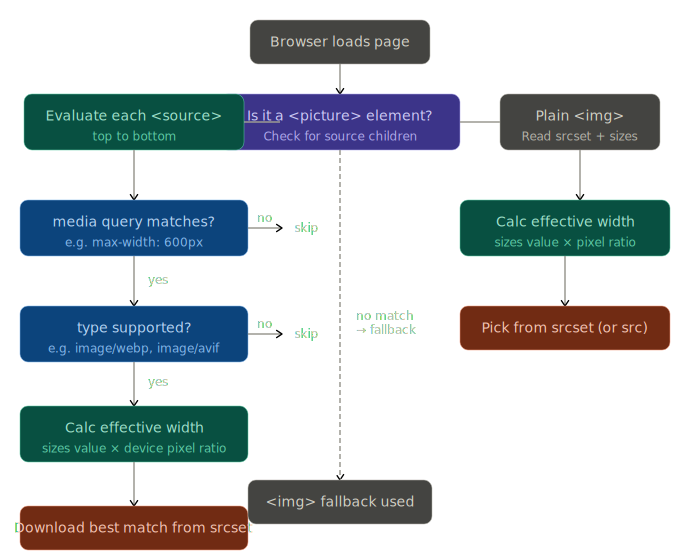

# Image size optimization

Here's a clear explanation of the `<picture>` element with `srcset`, one of the most powerful tools for responsive images.

---

## The `<picture>` element and `srcset`

There are two main patterns, and they solve different problems.

### Pattern 1 — `srcset` with `sizes` (resolution switching)

Use this when the image is the **same crop** at all sizes, just scaled differently. The browser picks the best source based on screen width and pixel density.

```html

```

The `sizes` attribute tells the browser how wide the image will actually render — not the viewport width. For example, `60vw` means "on large screens, this image takes up 60% of the viewport." The browser multiplies that by the device pixel ratio and picks the closest source from `srcset`.

The `src` attribute is the fallback for browsers that don't understand `srcset`.

---

### Pattern 2 — `<picture>` with `<source>` (art direction)

Use this when you want a **different crop or composition** per device — like a wide landscape on desktop but a tight portrait on mobile.

```html
<picture>
  <!-- Mobile: square crop, served as WebP -->
  <source
    media="(max-width: 600px)"
    srcset="
      hero-mobile-400.webp 400w,
      hero-mobile-800.webp 800w
    "
    sizes="100vw"
    type="image/webp"
  >

  <!-- Tablet: mid crop, WebP -->
  <source
    media="(max-width: 1024px)"
    srcset="
      hero-tablet-800.webp   800w,
      hero-tablet-1200.webp 1200w
    "
    sizes="80vw"
    type="image/webp"
  >

  <!-- Desktop: wide crop, WebP with JPEG fallback -->
  <source
    srcset="
      hero-desktop-1200.webp 1200w,
      hero-desktop-1800.webp 1800w,
      hero-desktop-2400.webp 2400w
    "
    sizes="60vw"
    type="image/webp"
  >

  <!-- Fallback  — always required, always last -->
  
</picture>
```

The browser evaluates `<source>` elements **top to bottom** and uses the first one whose `media` query and `type` it supports. If nothing matches (or the browser doesn't support `<picture>`), it falls back to the ``.

---

### Key rules

`type="image/webp"` — lets you offer modern formats (WebP, AVIF) with graceful fallback. Put the most efficient format first.

`width` and `height` on `` — even with responsive images, set these to the intrinsic dimensions of the fallback image. The browser uses them to reserve layout space and prevent cumulative layout shift (CLS).

`loading="lazy"` — defer off-screen images. Use `loading="eager"` for your largest above-the-fold image (LCP candidate).

`decoding="async"` — tells the browser it can decode the image off the main thread.

---

Here's an reference that lets you see how breakpoint logic flows



---

### Practical sizing guidelines

A good rule of thumb for generating your image variants:

| Breakpoint | Typical render width | Sizes value | Sources to generate |
|---|---|---|---|
| Mobile | 360–600px | `100vw` | 400w, 800w (2× retina) |
| Tablet | 600–1024px | `80vw` | 800w, 1200w |
| Desktop | 1024px+ | `50–70vw` | 1200w, 1600w, 2400w |

Serve WebP as your primary format with a JPEG fallback — WebP is typically 25–35% smaller at equivalent quality. If you can generate AVIF, add it as a first `<source>` above WebP for even better compression on supported browsers.

---

### Sizes

The `srcset` widths you generate should map to where your layout actually changes, not arbitrary numbers. Here are the most practical sets:

---

#### Common breakpoint systems

**Tailwind-style (most popular)**
```
640w, 768w, 1024w, 1280w, 1536w
```
Matches Tailwind's `sm`, `md`, `lg`, `xl`, `2xl` breakpoints exactly. Good choice if you're already using Tailwind.

**Bootstrap-style**
```
576w, 768w, 992w, 1200w, 1400w
```
Matches Bootstrap 5's `sm` through `xxl`.

**Device-focused (practical minimums)**
```
480w, 768w, 1080w, 1440w, 1920w
```
Covers mobile portrait, tablet, HD laptop, desktop, and full HD. A solid general-purpose set.

**With retina doubles (high-DPI aware)**
```
400w, 800w, 1200w, 1600w, 2400w
```
Each pair doubles the previous — a 400px slot on a 2× retina screen fetches the 800w source. Simple math, easy to reason about.

---

#### How many variants do you actually need?

The browser picks the *closest* match, so diminishing returns kick in quickly. In practice:

- **3 sizes** covers most sites well — small, medium, large
- **4–5 sizes** makes sense for hero/banner images where quality is critical
- **More than 5** is rarely worth the build complexity

A minimal but solid set that covers almost every real case:

```html
srcset="
  image-480.webp   480w,
  image-960.webp   960w,
  image-1440.webp 1440w
"
sizes="
  (max-width: 640px)  100vw,
  (max-width: 1024px) 80vw,
  60vw
"

```

#### The key insight

The `w` descriptors in `srcset` are the **intrinsic pixel width of the file**, not a viewport breakpoint. The `sizes` attribute is where you describe viewport breakpoints. The browser does the math:

- On a 375px mobile screen with `sizes="100vw"` → needs 375px → fetches `480w` ✓
- Same screen but Retina (2×) → needs 750px → fetches `960w` ✓
- On a 1280px desktop with `sizes="60vw"` → needs 768px → fetches `960w` ✓

So your `srcset` variants don't need to exactly mirror CSS breakpoints — they just need enough steps that the browser always finds something close without jumping too far up in file size.

---

### Tools

Here are the main options, from simplest to most powerful:

---

### 1. Sharp (Node.js)

most popular, most control

Here's a breakdown of the main options, organized by how you're building your site:Click any node for a deep-dive on that option. Here's the detail on each path:




---

### 1. Sharp — standalone Node script

The lowest-level, most portable option. Works with any stack.

```js
// scripts/generate-images.mjs
import sharp from 'sharp'
import { glob } from 'glob'
import path from 'path'

const widths = [480, 960, 1440]
const formats = ['webp', 'avif', 'jpeg']
const quality = { webp: 80, avif: 65, jpeg: 82 }

const files = await glob('src/images/**/*.{jpg,png}')

for (const file of files) {
  const name = path.basename(file, path.extname(file))
  const dir = 'public/images'

  for (const width of widths) {
    for (const format of formats) {
      await sharp(file)
        .resize(width)
        [format]({ quality: quality[format] })
        .toFile(`${dir}/${name}-${width}.${format}`)
    }
  }
}
```

Add to `package.json`:

```json
"scripts": {
  "images": "node scripts/generate-images.mjs",
  "build": "npm run images && your-build-command"
}
```

Run once and commit the output, or regenerate on every CI build. Sharp uses libvips under the hood, so it's extremely fast — thousands of images in seconds.

---

### 2. Framework plugins — zero config if you're already using one

**Next.js** — the `next/image` component handles everything automatically at runtime via its image optimization API:

```jsx
import Image from 'next/image'

<Image
  src="/hero.jpg"
  width={1440}
  height={720}
  sizes="(max-width: 640px) 100vw, (max-width: 1024px) 80vw, 60vw"
  alt="Hero"
/>
```

No pre-generation needed — Next.js resizes, converts to WebP/AVIF, and caches on demand.

**Astro** — similar built-in support since v3:

```astro
---
import { Image } from 'astro:assets'
import hero from '../assets/hero.jpg'
---

<Image src={hero} widths={[480, 960, 1440]} formats={['avif', 'webp']}
  sizes="(max-width: 640px) 100vw, 60vw" alt="Hero" />
```

**Vite** — use `vite-imagetools` for import-time transforms:

```js
// vite.config.js
import { imagetools } from 'vite-imagetools'
export default { plugins: [imagetools()] }
```

```js
import heroSrcset from './hero.jpg?w=480;960;1440&format=webp&as=srcset'
// → "hero-480.webp 480w, hero-960.webp 960w, hero-1440.webp 1440w"
```

**Eleventy** — `@11ty/eleventy-img` generates files and returns metadata you use to build the `<picture>` markup yourself, which gives you maximum control.

---

### 3. Image CDN — no build step at all

Services like Cloudinary, Imgix, and Bunny.net let you encode transforms in the URL. You upload one master image, and the CDN handles resizing, format conversion, and caching on demand.

```html
<picture>
  <source
    type="image/avif"
    srcset="
      https://res.cloudinary.com/demo/image/upload/w_480,f_avif/hero.jpg  480w,
      https://res.cloudinary.com/demo/image/upload/w_960,f_avif/hero.jpg  960w,
      https://res.cloudinary.com/demo/image/upload/w_1440,f_avif/hero.jpg 1440w
    "
    sizes="(max-width: 640px) 100vw, 60vw"
  >
  
</picture>
```

The main advantage is zero build time and instant updates when you swap the source image. The trade-off is a monthly cost once you exceed free-tier bandwidth, and a network dependency.

---

### Which to pick

If you're on Next.js, Astro, or Nuxt — use the built-in. If you're on a plain HTML/Vite site — Sharp script is the most reliable. If you have a CMS or content team uploading images — an image CDN saves the most operational friction.

